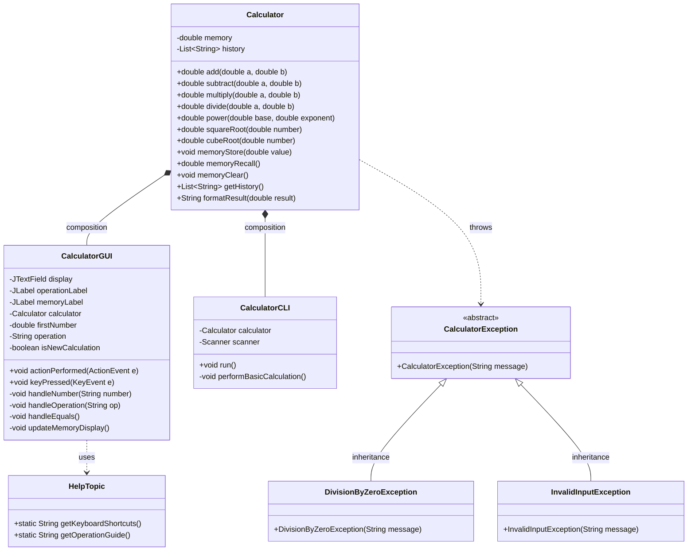

# UML Class Diagram

## Calculator System Architecture

## Class Relationships

### Composition
- **CalculatorGUI** and **CalculatorCLI** both contain a **Calculator** instance
- Strong "has-a" relationship where GUI/CLI cannot exist without Calculator

### Inheritance
- **DivisionByZeroException** and **InvalidInputException** extend **CalculatorException**
- Demonstrates polymorphism in exception handling

### Dependency
- **Calculator** throws **CalculatorException** subtypes
- **CalculatorGUI** uses **HelpTopic** for help system

## Design Patterns Used

1. **Model-View-Controller (MVC)**
   - Model: `Calculator` (business logic)
   - View: `CalculatorGUI`, `CalculatorCLI` (presentation)
   - Controller: Event handlers in GUI/CLI

2. **Strategy Pattern**
   - Different operation strategies (add, subtract, multiply, divide)
   - Encapsulated in Calculator methods

3. **Observer Pattern**
   - GUI components observe user input events
   - ActionListener and KeyListener implementations